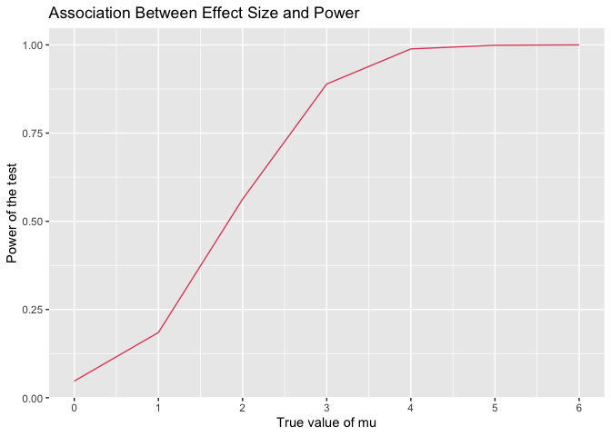
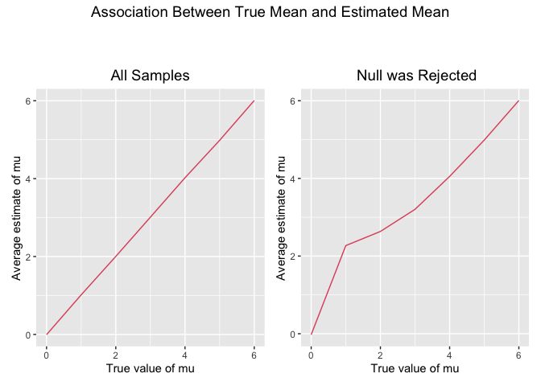

p8105_hw5_av2718
================
Angelica Vina Albarracin
2022-11-16

# Problem 2

``` r
#Load data raw data
homicide_raw = read_csv("data/homicide-data.csv") %>% 
  janitor::clean_names()

#Visualize first 8 rows
head(homicide_raw, 8) # view first 8 rows of raw data
## # A tibble: 8 × 12
##   uid    repor…¹ victi…² victi…³ victi…⁴ victi…⁵ victi…⁶ city  state   lat   lon
##   <chr>    <dbl> <chr>   <chr>   <chr>   <chr>   <chr>   <chr> <chr> <dbl> <dbl>
## 1 Alb-0…  2.01e7 GARCIA  JUAN    Hispan… 78      Male    Albu… NM     35.1 -107.
## 2 Alb-0…  2.01e7 MONTOYA CAMERON Hispan… 17      Male    Albu… NM     35.1 -107.
## 3 Alb-0…  2.01e7 SATTER… VIVIANA White   15      Female  Albu… NM     35.1 -107.
## 4 Alb-0…  2.01e7 MENDIO… CARLOS  Hispan… 32      Male    Albu… NM     35.1 -107.
## 5 Alb-0…  2.01e7 MULA    VIVIAN  White   72      Female  Albu… NM     35.1 -107.
## 6 Alb-0…  2.01e7 BOOK    GERALD… White   91      Female  Albu… NM     35.2 -107.
## 7 Alb-0…  2.01e7 MALDON… DAVID   Hispan… 52      Male    Albu… NM     35.1 -107.
## 8 Alb-0…  2.01e7 MALDON… CONNIE  Hispan… 52      Female  Albu… NM     35.1 -107.
## # … with 1 more variable: disposition <chr>, and abbreviated variable names
## #   ¹​reported_date, ²​victim_last, ³​victim_first, ⁴​victim_race, ⁵​victim_age,
## #   ⁶​victim_sex
```

This problem focuses on the `Homicide-data.csv` that The Washington Post
gathered in 50 large U.S. cities and made available through GitHub. The
raw data comprises 52179, 12observations. The data included the
geographical location of the homicide, whether an arrest was made, and,
in most cases, basic demographic information about each victim. In
total, the dataset contains 12 variables: city, disposition, lat, lon,
reported_date, state, uid, victim_age, victim_first, victim_last,
victim_race, victim_sex. Interestingly, the first and last names of the
victims are included in the data, as well as the exact location of the
homicide (lat and log).

In the code chunk below, we create a `city_state variable` (e.g.,
“Baltimore, MD”) and then summarize within cities to obtain the number
of homicides and the number of unsolved homicides per city (“Closed
without arrest” or “Open/No arrest”). Then, we calculate the total
number of homicides per city by adding a new column to the resulting
dataset.

``` r
#Clean and arrange raw variables

homicide_clean = homicide_raw %>% 
  mutate(.data = ., city_state = str_c(city, ", " ,state)) %>% 
  select(-city, -state) %>% 
  mutate(
    disposition = if_else(disposition %in% c("Closed without arrest", "Open/No arrest"), "unsolved_homicides", "homicides") 
  )

# Create new dataset with homicides and unsolved homicides summarized by city_sate

homicide_cities = homicide_clean %>% 
  group_by(city_state, disposition) %>% 
  summarize(n_obs = n())  

homicide_cities = pivot_wider(
  homicide_cities,
  names_from = "disposition",
  values_from = "n_obs") 
homicide_cities[is.na(homicide_cities)]<- 0 #Change NA values to 0

#Add column with total number of homicides

homicide_cities = 
  mutate(homicide_cities,
  total_homicides = homicides + unsolved_homicides)

#Visualize first 8 rows of new dataframe

head(homicide_cities, 8) # view first 8 rows of tidied data
## # A tibble: 8 × 4
## # Groups:   city_state [8]
##   city_state      homicides unsolved_homicides total_homicides
##   <chr>               <int>              <int>           <int>
## 1 Albuquerque, NM       232                146             378
## 2 Atlanta, GA           600                373             973
## 3 Baltimore, MD        1002               1825            2827
## 4 Baton Rouge, LA       228                196             424
## 5 Birmingham, AL        453                347             800
## 6 Boston, MA            304                310             614
## 7 Buffalo, NY           202                319             521
## 8 Charlotte, NC         481                206             687
```

For the city of Baltimore, MD, in the code chunk below, we use the
`propw.test` function to estimate the proportion of unsolved homicides.
Then and apply the `broom::tidy` function from the broom package to
constructs a `tibble` that summarizes the findings.

``` r
#Filter Baltimore data

baltimore_homicides = homicide_cities %>% 
  filter(city_state == "Baltimore, MD") 

#Prop.test

prop_test = prop.test(
  x = pull(baltimore_homicides , unsolved_homicides),
  n = pull(baltimore_homicides, total_homicides)) %>% 
  broom::tidy() %>% 
  select(estimate, conf.low, conf.high)

prop_test
## # A tibble: 1 × 3
##   estimate conf.low conf.high
##      <dbl>    <dbl>     <dbl>
## 1    0.646    0.628     0.663
```

*Proportion of homicides in Baltimore:* As reported above, the estimate
proportion of unsolved homicides in Baltimore city is 0.6455607, with a
confidence interval between 0.6275625 and 0.6631599.

Lastly, we run a `prop.test` for each city and extract the proportion of
unsolved homicides and the confidence interval for each. To do this, we
create a \`func_prop.test’ function that we then apply to the entire
data frame.

``` r
#Create prop.test function

func_prop.test = function(homicide_cities){
  prop_test_cities = prop.test(
    x = pull(homicide_cities , unsolved_homicides),
    n = pull(homicide_cities, total_homicides)) %>% 
    broom::tidy() %>% 
    select(estimate, conf.low, conf.high)

prop_test_cities
}

#Extract proportion of unsolved homicides and CIs for each city

prop_homicides = homicide_cities %>% 
  nest(data = unsolved_homicides:total_homicides) %>% 
  mutate(results = map(data, func_prop.test)) %>% 
  select(city_state, results) %>% 
  unnest(cols = results) 
## Warning in prop.test(x = pull(homicide_cities, unsolved_homicides), n =
## pull(homicide_cities, : Chi-squared approximation may be incorrect

#Visualize first 3 rows of results

head(prop_homicides, 3) 
## # A tibble: 3 × 4
## # Groups:   city_state [3]
##   city_state      estimate conf.low conf.high
##   <chr>              <dbl>    <dbl>     <dbl>
## 1 Albuquerque, NM    0.386    0.337     0.438
## 2 Atlanta, GA        0.383    0.353     0.415
## 3 Baltimore, MD      0.646    0.628     0.663
```

#### Proportion of Unsolved Homicides in US cities

In the code chunk below, we use our new `prop_homicides` data frame to
visualize the proportion of unsolved homicides in each US city. The plot
shows that Chicago has the largest proportion of unsolved homicides
among US cities, followed by Baltimore and New Orleans. Tulsa has the
lowest proportion of unsolved homicides, but the data is unreliable as
only one homicide was reported.

``` r
# Create plot

plot_homicides = prop_homicides %>% 
  select(city_state, estimate, conf.low, conf.high) %>%
  mutate(city_state = fct_reorder(city_state, estimate)) %>% #reorder cities according to proportion of homicides
  ggplot(aes( y = estimate, x = city_state)) +
  geom_point(color = 4) +
  geom_errorbar(aes(ymin = conf.low, ymax = conf.high)) + # add error bars based on CIs 
  labs(title = "Proportion of Unsolved Homicides in US Cities", 
         x = "US Cities", 
         y = "Proportion of Unsolved Homicides")+
  theme(axis.text.x = element_text(angle = 90, vjust = 0.5, hjust = 1)) +
  theme(axis.text.y = element_text(size = 6)) +
  theme(plot.title = element_text(hjust = 0)) +
  theme(axis.ticks = element_blank()) +
  theme(axis.text = element_text(size = 7)) +
  theme(legend.title = element_text(size = 8)) +
  theme(legend.text = element_text(size = 6)) +
  theme(plot.title = element_text(hjust = 0.5))

  plot_homicides
```

<!-- -->

``` r
  
  
ggsave("Homicides_US.Cities.png", plot = last_plot())
       
```

# Problem 3

In this problem, we will conduct a simulation to explore power (aka. the
likelihood of detecting a true effect if there is one) in a one-sample
t-test. The one-sample t-test is used to compare the differences between
sample means.

*Step 1:*

Then we will generate *5000 datasets* from the normal distribution:
*x∼Normal\[μ,σ\]*

First, we will write our model function and predefine the following
elements:

*Fix n=30* *Fix σ=5*

``` r

func_t.test = function(n = 30, mu, sigma = 5) { #predefine constants
  random_data = tibble(
    x = rnorm(n, mean = mu, sd = sigma))  #produce n rvs for normal distribution
  
 broom::tidy(t.test(random_data, conf.level = 0.95)) #perform t.test and clean output
}
```

*Step 2:*

Now we will run the simulation for *mean={0,1,2,3,4,5,6}*:

``` r
power_data =
  expand.grid(
    sample_size = 30,
    mu = c(0,1,2,3,4,5,6),  # set mu values 
    iter = 1:5000
  ) %>% 
  mutate(
   test_results = map2(.x = sample_size, .y = mu, ~ func_t.test(n = .x, mu =.y))
  ) %>% 
  unnest(test_results) 

#Visualize first 3 rows of results

head(power_data, 8)
## # A tibble: 8 × 11
##   sample_size    mu  iter estim…¹ stati…² p.value param…³ conf.…⁴ conf.…⁵ method
##         <dbl> <dbl> <int>   <dbl>   <dbl>   <dbl>   <dbl>   <dbl>   <dbl> <chr> 
## 1          30     0     1  0.385    0.431 6.70e-1      29  -1.44     2.21 One S…
## 2          30     1     1  0.0967   0.111 9.13e-1      29  -1.69     1.88 One S…
## 3          30     2     1  0.917    1.11  2.76e-1      29  -0.773    2.61 One S…
## 4          30     3     1  2.42     2.35  2.56e-2      29   0.316    4.52 One S…
## 5          30     4     1  2.81     3.50  1.51e-3      29   1.17     4.45 One S…
## 6          30     5     1  5.20     4.84  3.98e-5      29   3.00     7.40 One S…
## 7          30     6     1  4.86     5.34  9.97e-6      29   3.00     6.72 One S…
## 8          30     0     2  1.40     1.48  1.49e-1      29  -0.532    3.33 One S…
## # … with 1 more variable: alternative <chr>, and abbreviated variable names
## #   ¹​estimate, ²​statistic, ³​parameter, ⁴​conf.low, ⁵​conf.high
```

*Step 3:*

Now we have generated the data, we will make a plot showing the
proportion of times the null hypothesis was rejected (the power of the
test):

``` r
# Create plot

power_plot = power_data %>% 
  group_by(mu) %>% 
  filter(p.value < 0.05) %>% #Null hypothesis rejected
  summarize(proportion = n()) %>% 
  ggplot(aes(x = mu, y = proportion/5000)) +
  geom_line(color = 2) +
  scale_x_continuous(breaks = 0:6) +
  labs(x = "True value of mu",
       y = "Power of the test",
       title = "Association Between Effect Size and Power")
  
  power_plot
```

<!-- -->

``` r
  
  ggsave("power_plot.png", plot = last_plot())
```

*Association Between Effect Size and Power*: In the plot, we can see
that as the true mean increases, so does the power of the test, as the
probability of correctly rejecting the null hypothesis increases. The
power of the test gets close enough to 1 when mean= 4, meaning that
effect size/ difference between means is big enough to detect a true
effect and reject the null hypothesis with confidence.

Lastly, we make a plot comparing the average expected mean vs. the true
mean, for all the samples generated in our simulation and, for only in
samples for which the null was rejected:

``` r
#estimate of mu for all samples

power_average = power_data %>% 
  group_by(mu) %>% 
  summarize(mean_est = mean(estimate)) 

#estimate of mu when null is rejected

power_average2 = power_data %>% 
  filter(p.value < 0.05) %>% 
  group_by(mu) %>% 
  summarize(mean_est = mean(estimate)) 

# Create comparison plot

plot1 = power_average %>% 
  ggplot(aes(x = mu, y = mean_est)) +
  geom_line(color = 2) +
  labs(
    title = "All Samples",
    x = "True value of mu",
    y = "Average estimate of mu"
  )
plot2 = power_average2 %>%
  ggplot(aes(x = mu, y = mean_est))+
  geom_line(color = 2)+
  labs(
    title = " Null was Rejected",
    x = "True value of mu",
    y = "Average estimate of mu"
  )

library(patchwork)

mu_plot = 
  guide_area() + (plot1 + plot2) +   # Combine plots using patchwork package
  plot_layout(guides = "keep",
              nrow = 2, heights = c(1,10)) +
  plot_annotation(title = "Association Between True Mean and Estimated Mean") &
  theme(plot.title = element_text(size = 14)) +
  theme(legend.position = "bottom") +
  theme(legend.title = element_text(size = 8)) +
  theme(legend.text = element_text(size = 6)) +
  theme(plot.title = element_text(hjust = 0.5))

mu_plot
```

<!-- -->

``` r
ggsave("mu_plot.png", plot = last_plot())
```

*Association Between True Mean and Estimated Mean:* As we can see in the
plot, the average mean across tests for which the null is rejected is
approximately equal to the true value of mu. This is because as the true
value of mu increases, the test’s power increases, aka., the probability
of correctly rejecting the null hypothesis increases.
